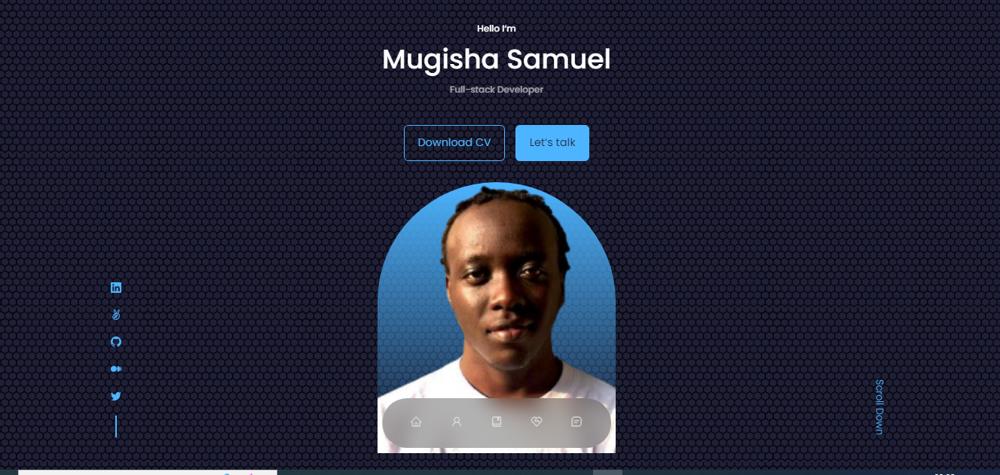

# My Portfolio website
> This is my portfolio website showcasing who I am, my skills, the services I provide, the  experience I have in this field and what other people who we have worked together talk about me. It is built with React.js
## Desktop view




# Live demo
[Live Demo](https://samportfolio42.netlify.app/)


Additional description about the project and its features.

## Built With

- Major languages (HTML, CSS, JavaScript)

- Frameworks / Libraries
  ```bash
  - React (Front end library)
  - React Bootstrap
  - React icons
  - React Testing Library
  - Jest(for testing)
  - Git(version control)
  - ESLint(JavaScript linting)
  - Stylelint(style linting)
  ```

- Technologies used 
  
  ``` bash
  - Git(version control)
  ```


## Getting Started

To get a local copy up and running follow these simple example steps.

### Prerequisites
 - A text editor(preferably Visual Studio Code)

### Install
  -  [Git](https://git-scm.com/downloads)
  -  [Node](https://nodejs.org/en/download/)

### Usage
#### Clone this repository

```bash
$ git clone `https://github.com/mugishasam123/Portfolio.git`
$ cd Portfolio
```
#### Run project

```bash
$ npm install
$ npm build
$ npm run test
$ npm start
```

#### Open page in browser
```bash
$ runs on http://localhost:3000/
```

## Author

👤 **Mugisha Samuel**

- GitHub: [@mugishasamuel](https://github.com/mugishasam123)
- Twitter: [@mugishsamuel](https://twitter.com/mugishasamuel42/)
- LinkedIn: [mugishasamuel](https://www.linkedin.com/in/mugisha-samuel-55a905208/)

## 🤝 Contributing

Contributions, issues, and feature requests are welcome!

Feel free to check the [issues page](https://github.com/mugishasam123/Portfolio/issues).


## Show your support

Give a ⭐️ if you like this project!

## 📝 License

This project is [MIT](https://opensource.org/licenses/MIT) licensed.
